# EJ O'Kelly

> **Note:** I recently lost my account to a shady hotspot and I ended up just creating a new one.

## Featured Projects

🚀 **[Job Hunter](https://github.com/ejokelly/job-hunter)** - An example of how I approach building modern applications with React, Next.js, and AI integration. Built in under 8 hours using my development methods.

🤖 **[Whytilt.com](https://whytilt.com)** - My Vision/Action agent that automates jobs, tasks, and tests using AI-powered computer vision and action models.

## Project Screenshots

<table>
  <tr>
    <td width="25%"><a href="screenshots/1.png" target="_blank">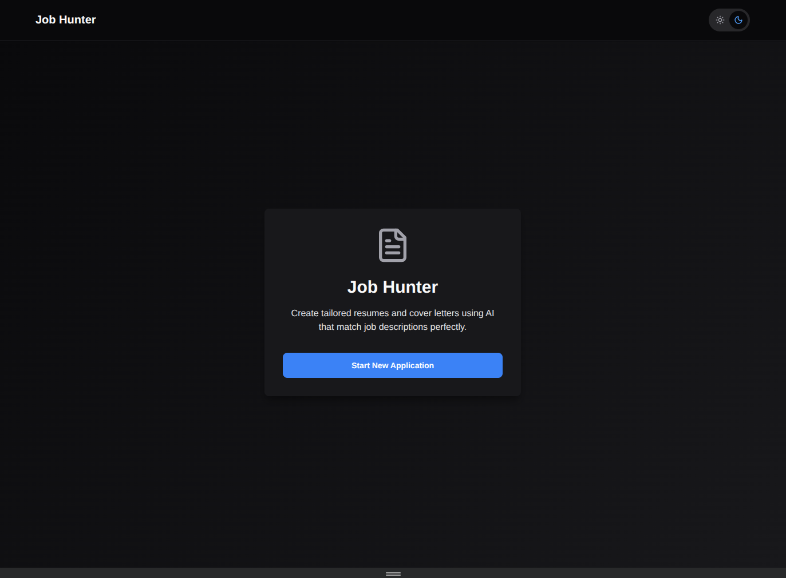</a></td>
    <td width="25%"><a href="screenshots/2.png" target="_blank">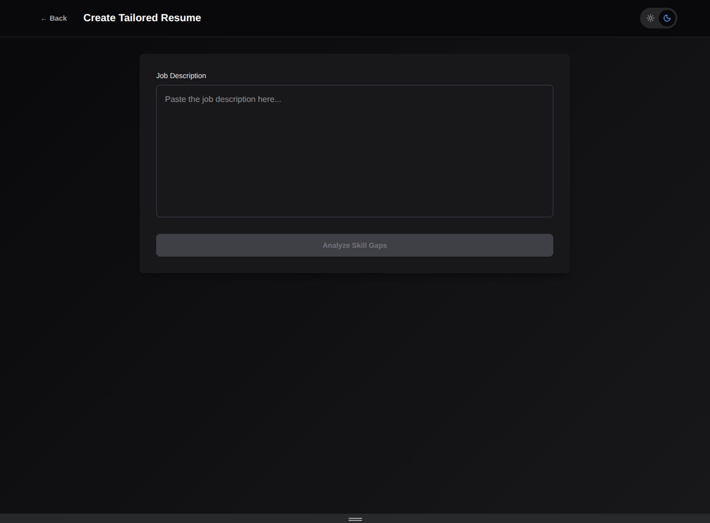</a></td>
    <td width="25%"><a href="screenshots/3.png" target="_blank">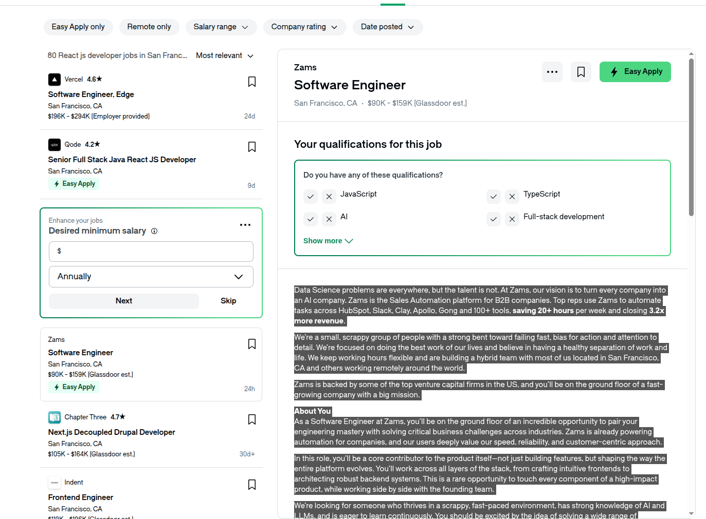</a></td>
    <td width="25%"><a href="screenshots/4.png" target="_blank">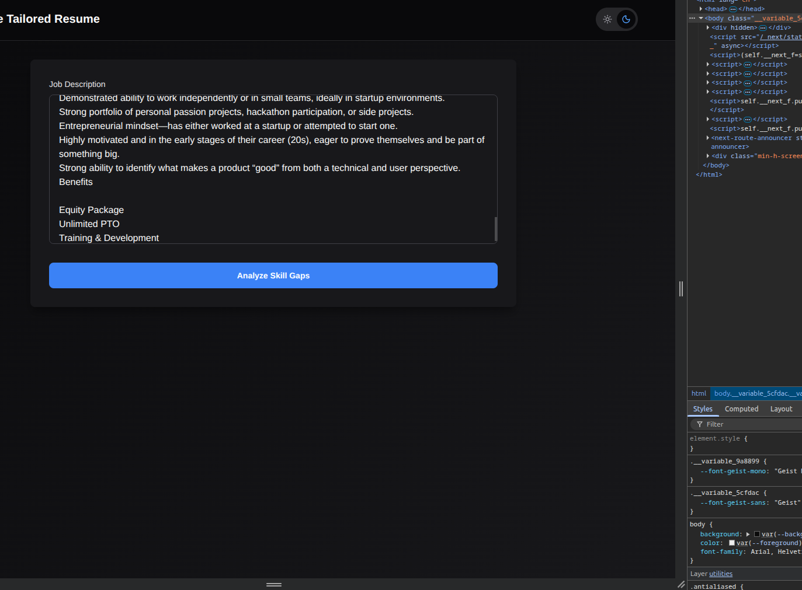</a></td>
  </tr>
  <tr>
    <td width="25%"><a href="screenshots/5.png" target="_blank">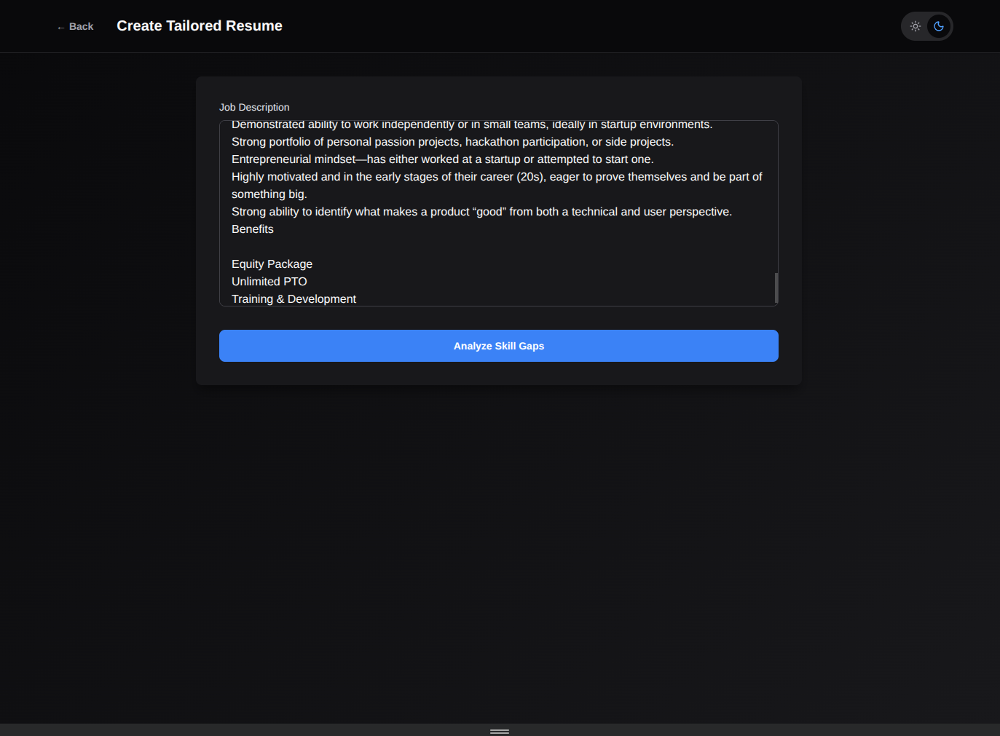</a></td>
    <td width="25%"><a href="screenshots/6.png" target="_blank">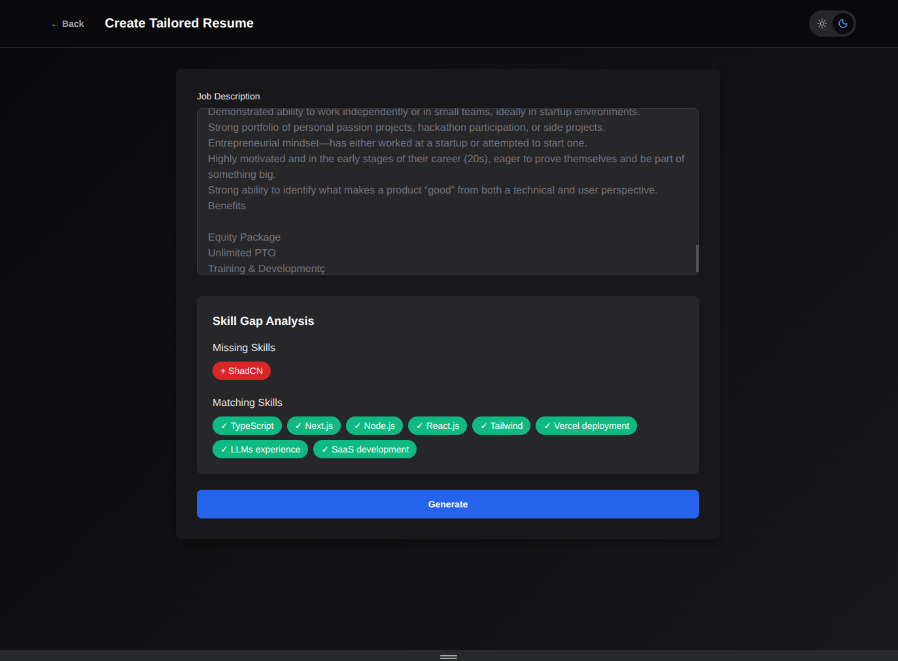</a></td>
    <td width="25%"><a href="screenshots/7.png" target="_blank">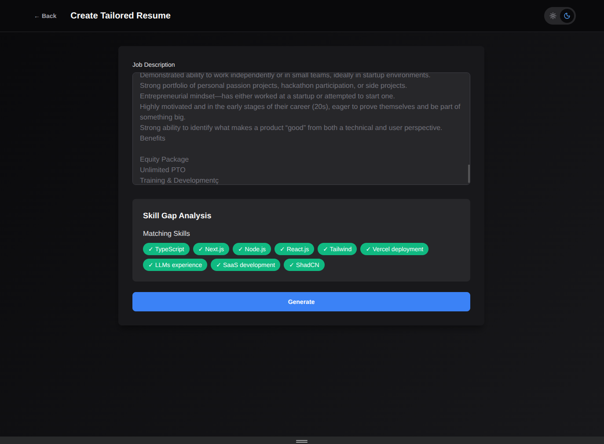</a></td>
    <td width="25%"><a href="screenshots/8.png" target="_blank">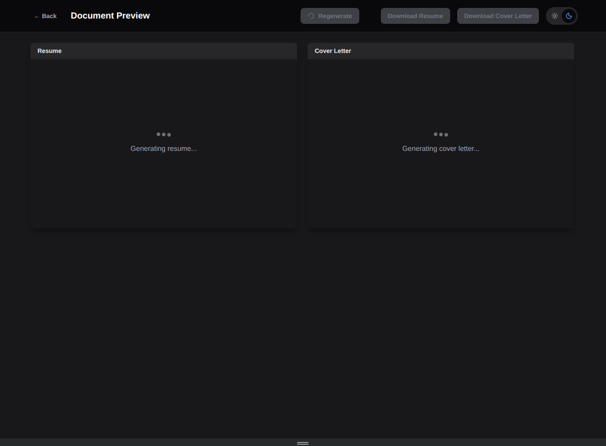</a></td>
  </tr>
  <tr>
    <td width="25%"><a href="screenshots/9.png" target="_blank">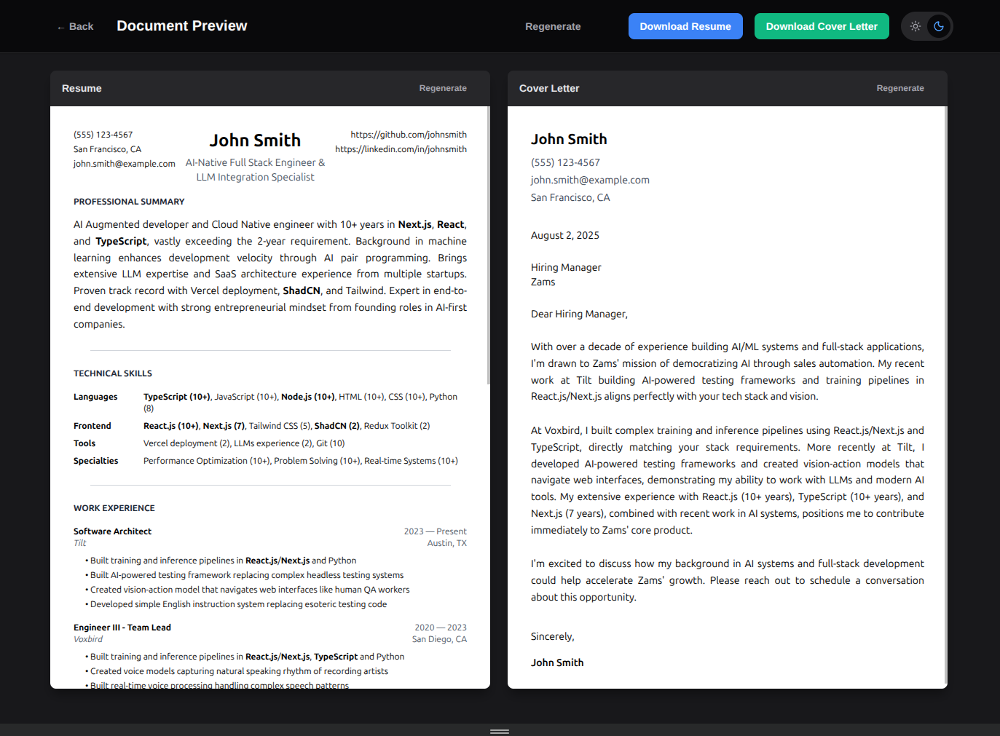</a></td>
    <td width="25%"><a href="screenshots/10.png" target="_blank">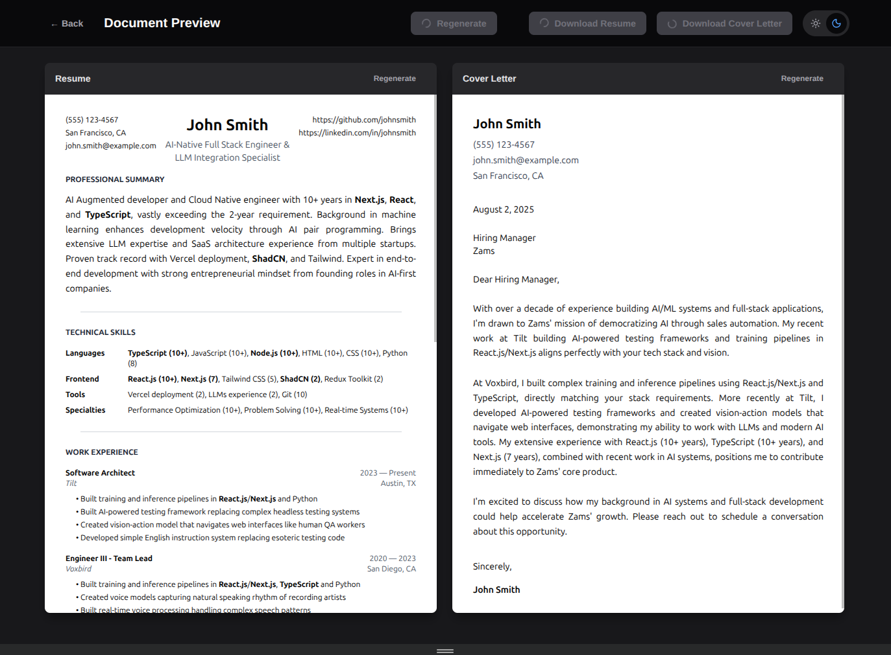</a></td>
    <td width="25%"><a href="screenshots/11.png" target="_blank">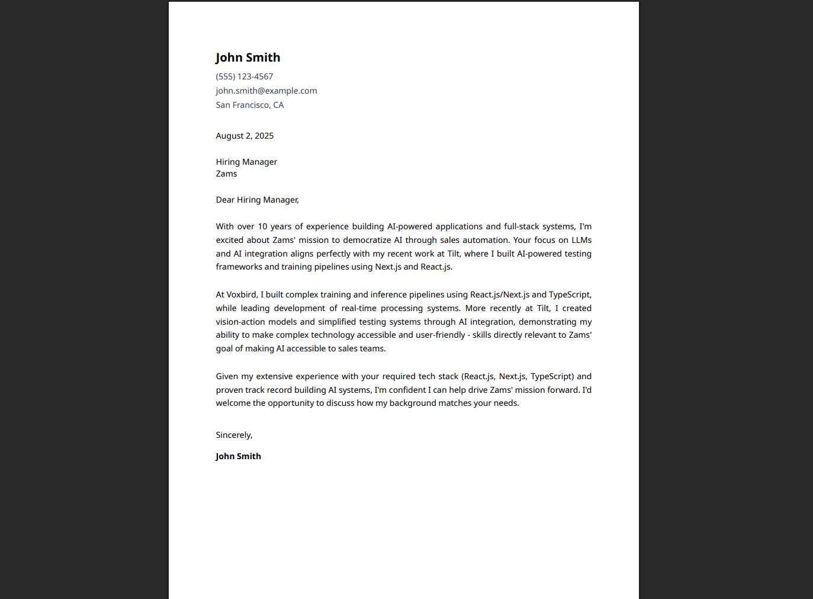</a></td>
    <td width="25%"><a href="screenshots/12.png" target="_blank">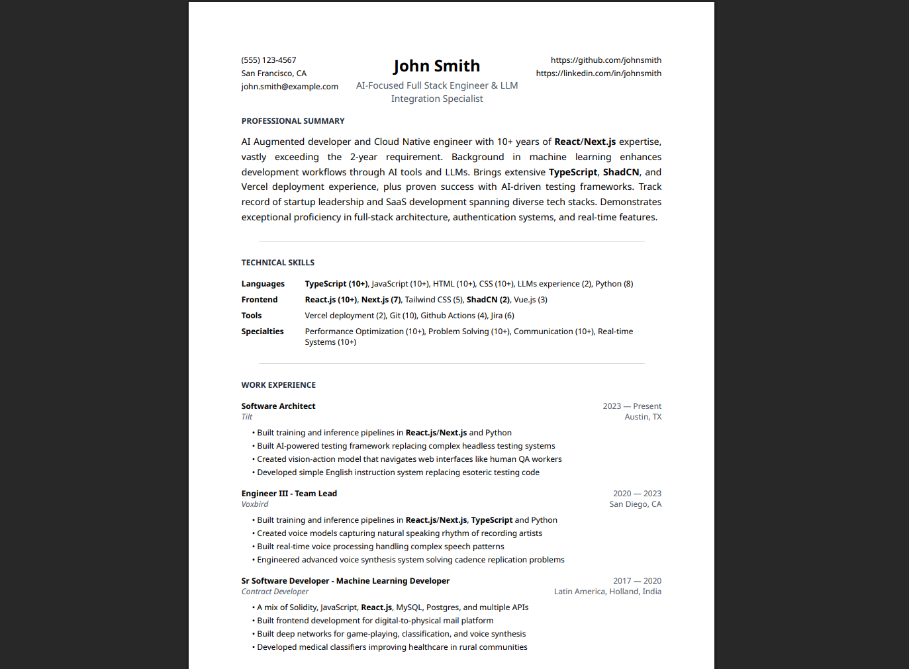</a></td>
  </tr>
</table>

---

**Software Engineer & AI Specialist**  
📧 hello+ej@whytilt.com | 📞 (619) 394-6221 | 📍 San Francisco, CA  
🔗 [GitHub](https://github.com/ejokelly)

## Summary

I build full-stack systems that push technical boundaries, specializing in React.js and Next.js applications from real-time trading platforms to AI-powered testing frameworks. With over a decade of React experience, I create scalable frontend architectures and have recently integrated cutting-edge AI and machine learning capabilities into web applications. My coding experience predates the AI boom, allowing me to code and debug effectively with or without AI assistance—my preferred model being Claude Code. I combine deep React/Next.js expertise with practical problem-solving learned from years of challenging projects across fintech, aerospace, and enterprise automation.

## Technical Skills

**Languages:** JavaScript (10+), TypeScript (10+), Python (8), Ruby (10+), C# (5), C (8), HTML (10+), CSS (10+), SQL (10+), GraphQL (4), Solidity (3), DeFi experience (2), Web analytics tools (2), Core Web Vitals (2), socket.io (2)

**Frontend:** React.js, Next.js, Vue.js, Tailwind CSS, Sass/SCSS, Webpack, Vite, AJAX, jQuery, Bootstrap, Angular

**Backend:** Node.js, Express.js, Django, Flask, Ruby on Rails, .NET, ASP.NET, FastAPI, GraphQL, REST APIs, SOAP

**AI/ML:** Machine Learning, Deep Learning, Computer Vision, Voice Synthesis, Neural Networks, TensorFlow, PyTorch, OpenAI API, Anthropic Claude, Hugging Face, Language Models, Visual Models, Audio Models, Vision/Action Models

**AWS:** EC2, S3, RDS, Lambda, API Gateway, CloudFront, SQS, SNS, DynamoDB, ECS, Fargate, ElastiCache, CloudWatch, IAM, VPC, Route 53, ELB/ALB, Auto Scaling, CloudFormation

**DevOps:** Docker, Kubernetes, Terraform, Chef, Jenkins, GitLab CI, Git, GitHub Actions, CI/CD, Linux, Unix, Bash, Nginx, Apache

**Databases:** PostgreSQL, MongoDB, Redis, MySQL, Vector Databases, Elasticsearch, SQLite

**Testing:** Jest, pytest, RSpec, Selenium, Mocha, Chai, Minitest, Jasmine, Playwright, Enzyme

**Specialties:** Real-time Systems, Trading Platforms, Cryptocurrency/Blockchain, Voice Processing, Web Automation, Performance Optimization, Security/Penetration Testing, Drone/Aircraft Systems, High-volume Systems

## Professional Experience

### Software Architect
**Tilt** | Austin, TX | 2023 - Present

• Built AI-powered testing framework replacing complex headless testing systems  
• Created vision-action model that navigates web interfaces like human QA workers  
• Developed simple English instruction system replacing esoteric testing code  
• Built training and inference pipelines in ReactJS/NextJS and Python  

### Engineer III - Team Lead
**Voxbird** | San Diego, CA | 2020 - 2023

• Engineered advanced voice synthesis system solving cadence replication problems  
• Built real-time voice processing handling complex speech patterns  
• Created voice models capturing natural speaking rhythm of recording artists  
• Built training and inference pipelines in ReactJS/NextJS, TypeScript and Python  

### Sr Software Developer - Machine Learning Developer
**Contract Developer** | Latin America, Holland, India | 2017 - 2020

• Built deep networks for game-playing, classification, and voice synthesis  
• Developed medical classifiers improving healthcare in rural communities  
• Built multiple web applications using NextJS, ReactJS, Typescript and MongoDB  

### Senior Developer
**Finexbox** | Dubai, UAE | 2015 - 2017

• Built trading interfaces processing millions in daily volume  
• Wrote and audited Solidity smart contracts for crypto exchange platform  
• Conducted penetration testing ensuring platform security  
• A mix of Solidity, JavaScript, ReactJS, MySQL, Postgres, and multiple APIs  

### Senior Software Engineer
**Airware** | San Francisco, CA | 2012 - 2015

• Built real-time web interfaces for autonomous drone control systems  
• Developed fleet management tools processing live telemetry data  
• Created responsive operator controls for aircraft management  
• Built in Embers.js then ReactJs, CSS, Javascript, Node and Postgres  

### Software Engineer
**Zairmail** | Portland, OR | 2007 - 2012

• Led frontend development for digital-to-physical mail platform  
• Built interactive drag-and-drop interfaces with early AJAX implementation  
• Built in C#, ASP.Net, JavaScript, and PERL  

## Education

### Bachelor of Science in Computer Science
**California State University San Marcos** | San Marcos, CA | August 2007

**Relevant Coursework:** C, LISP, Java

**Capstone Project:** Designed and implemented a telnet-based, multi-player text MMORPG in C, featuring real-time multi-user interaction, networking, and game logic

---
*Generated from data.json*