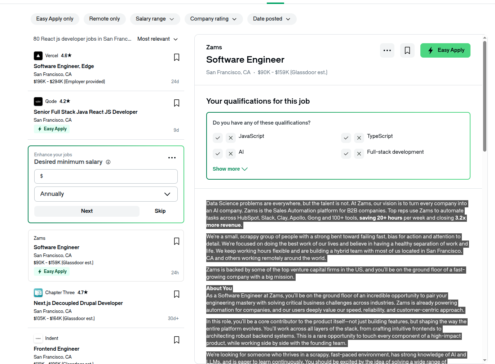
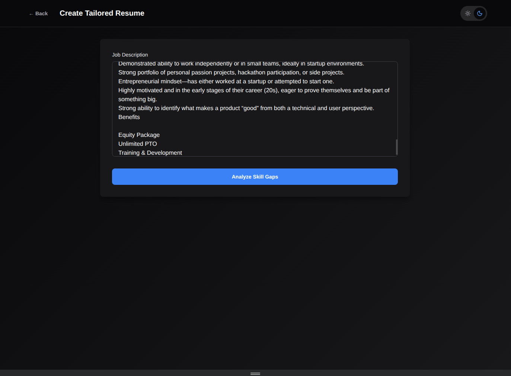
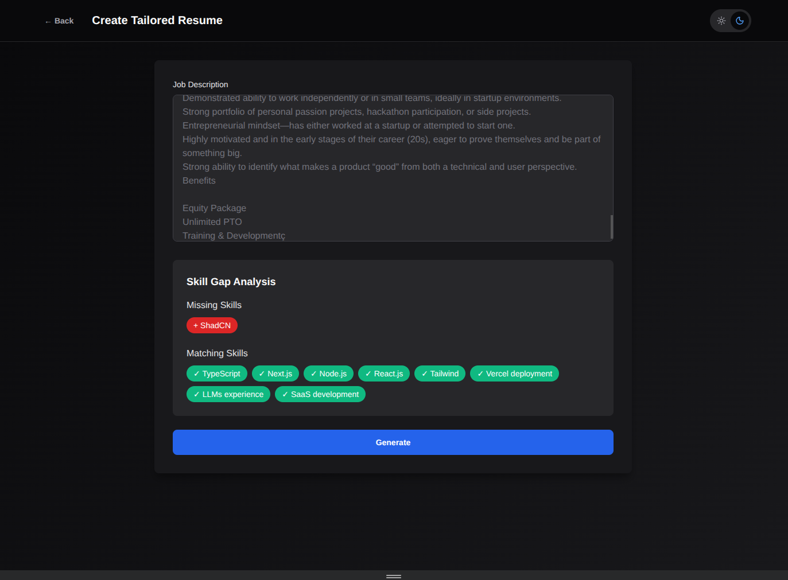
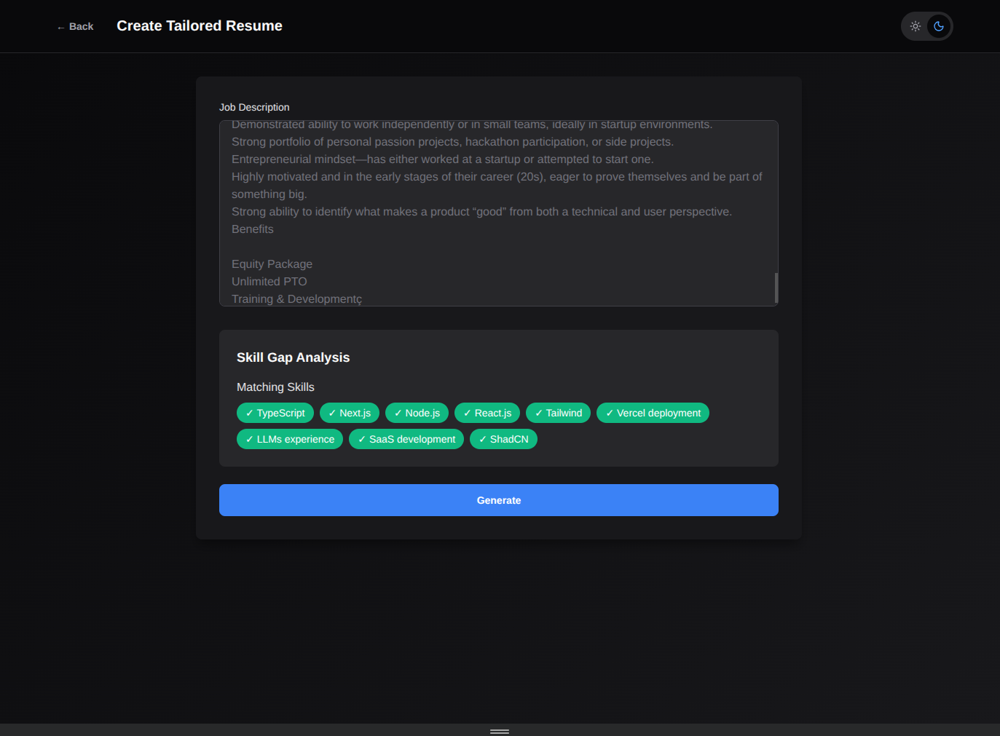
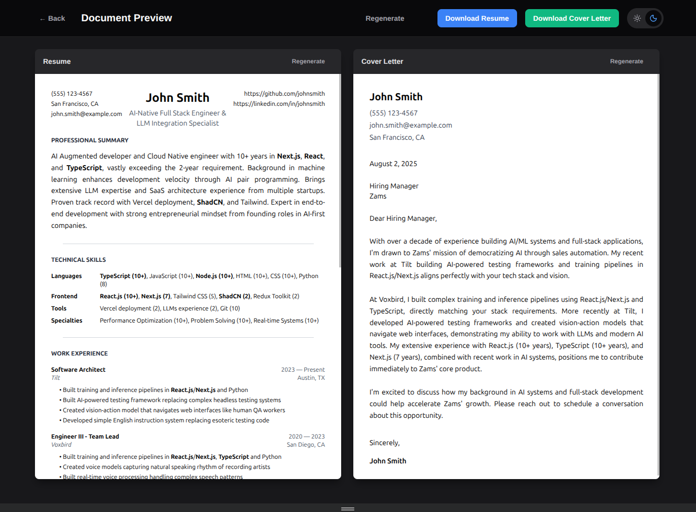
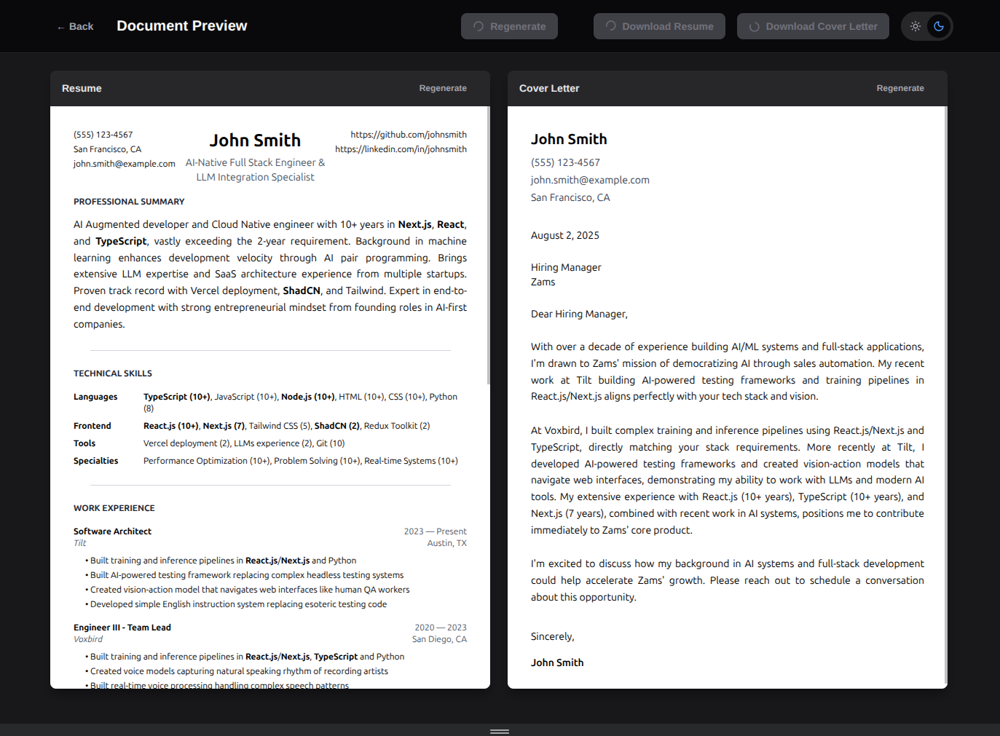

# {{{personalInfo.name}}}

> **Note:** I recently lost my account to a shady hotspot and I ended up just creating a new one.

## Featured Projects

🚀 **[Job Hunter](https://github.com/ejokelly/job-hunter)** - An example of how I approach building modern applications with React, Next.js, and AI integration. Built in under 8 hours using my development methods.

🤖 **[Whytilt.com](https://whytilt.com)** - My Vision/Action agent that automates jobs, tasks, and tests using AI-powered computer vision and action models.

## Project Screenshots

<table>
  <tr>
    <td width="25%"></td>
    <td width="25%"></td>
    <td width="25%"></td>
    <td width="25%"></td>
  </tr>
  <tr>
    <td width="25%"></td>
    <td width="25%"></td>
    <td width="25%"></td>
    <td width="25%"></td>
  </tr>
  <tr>
    <td width="25%"></td>
    <td width="25%"></td>
    <td width="25%"></td>
    <td width="25%"></td>
  </tr>
</table>

---

**{{{personalInfo.title}}}**  
📧 {{{personalInfo.email}}} | 📞 {{personalInfo.phone}} | 📍 {{personalInfo.location}}  
🔗 [GitHub]({{personalInfo.github}})

## Summary

{{{summary}}}

## Technical Skills

**Languages:** {{#each skills.languages}}{{name}} ({{years}}){{#unless @last}}, {{/unless}}{{/each}}

**Frontend:** {{#each skills.frontend}}{{name}}{{#unless @last}}, {{/unless}}{{/each}}

**Backend:** {{#each skills.backend}}{{name}}{{#unless @last}}, {{/unless}}{{/each}}

**AI/ML:** {{#each skills.aiMl}}{{name}}{{#unless @last}}, {{/unless}}{{/each}}

**AWS:** {{#each skills.awsServices}}{{name}}{{#unless @last}}, {{/unless}}{{/each}}

**DevOps:** {{#each skills.cloudDevops}}{{name}}{{#unless @last}}, {{/unless}}{{/each}}

**Databases:** {{#each skills.databases}}{{name}}{{#unless @last}}, {{/unless}}{{/each}}

**Testing:** {{#each skills.testing}}{{name}}{{#unless @last}}, {{/unless}}{{/each}}

**Specialties:** {{#each skills.specialties}}{{name}}{{#unless @last}}, {{/unless}}{{/each}}

## Professional Experience

{{#each experience}}
### {{role}}
**{{company}}** | {{location}} | {{startDate}} - {{endDate}}

{{#each achievements}}
• {{this}}  
{{/each}}

{{/each}}

## Education

{{#each education}}
### {{degree}}
**{{institution}}** | {{location}}{{#if graduationDate}} | {{graduationDate}}{{/if}}

{{#if coursework}}
**Relevant Coursework:** {{#each coursework}}{{this}}{{#unless @last}}, {{/unless}}{{/each}}
{{/if}}

{{#if capstone}}
**Capstone Project:** {{capstone}}
{{/if}}

{{/each}}

---
*Generated from data.json*